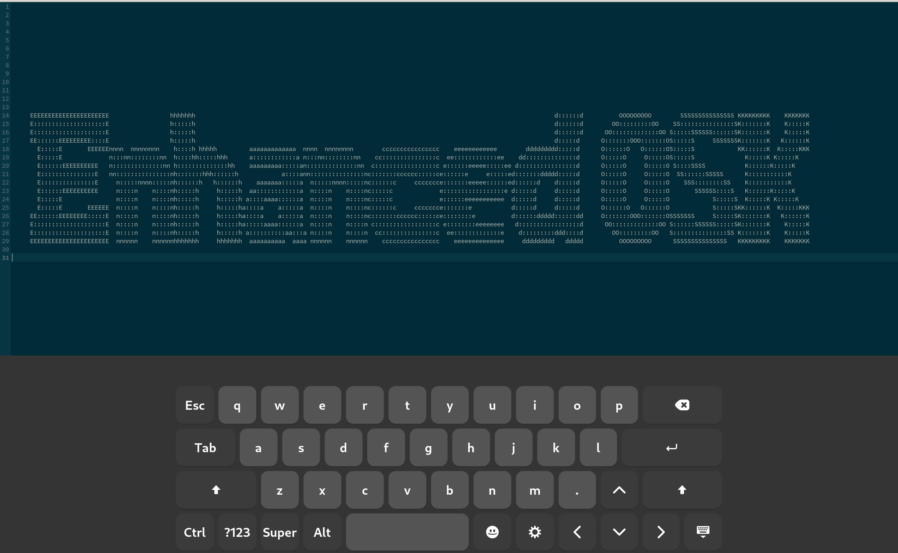

# enhanced-osk-gnome-ext

Makes Gnome's OnScreen Keyboard more usable.

Features:
* Includes additional buttons: Arrow keys, Esc, Tab, Ctrl, Alt, Super, F1-12
* Supports key combinations like `Ctrl + C`, `Alt + Tab`, `Ctrl + Shift + C`, etc.
* Configurable keyboard size (landscape/portrait)
* Statusbar indicator to toggle keyboard
* Works in Gnome password modals

Currently, the following layouts have extended keys: CH+FR, CH, DE, HU, ES, FR, IT, RU, UA, US.



This extension is a fork of [nick-shmyrev/improved-osk-gnome-ext](https://github.com/nick-shmyrev/improved-osk-gnome-ext) which is fork of [SebastianLuebke/improved-osk-gnome-ext](https://github.com/SebastianLuebke/improved-osk-gnome-ext).


## Installation

### From extensions.gnome.org

It is not in gnome extensions yet!

### From source code
Clone the repo, change into its root directory, run `package-extension.sh`,
install and enable the extension:

```console
git clone https://github.com/cass00/enhanced-osk-gnome-ext.git
cd ./enhanced-osk-gnome-ext
./package-extension.sh
gnome-extensions install enhancedosk@cass00.github.io.shell-extension.zip
gnome-extensions enable enhancedosk@cass00.github.io
```
After installing the extension, log out and back in to reload Gnome Shell. Then enable the extension.

```console
gnome-extensions enable enhancedosk@cass00.github.io
```

## FAQ
### My language layout doesn't have the additional keys.
If the layout you're using does not have the extended keys, let me know, and I'll add them.
Or, feel free to modify it yourself (see [/src/data/osk-layouts](https://github.com/cass00/enhanced-osk-gnome-ext/tree/master/src/data/osk-layouts) dir) and make a PR.

### How do I make a custom layout?
You'll need to follow the manual installation process from [README](https://github.com/cass00/enhanced-osk-gnome-ext/blob/master/README.md#from-source-code),
but before running `package-extension.sh` you'll have to make changes to your preferred layout
(see [osk-layouts](https://github.com/cass00/enhanced-osk-gnome-ext/tree/master/src/data/osk-layouts)), then continue with the installation process.

### I want to test this extension with a new version of Gnome.
To install the extension on an unsupported Gnome version, you can either add desired version number to `metadata.json` file and proceed with a manual installation,
or disable extension version check and then install from [extensions.gnome.org](https://extensions.gnome.org/extension/4413/enhanced-osk/):

```console
gsettings set org.gnome.shell disable-extension-version-validation true
```

See [TEST_CASES](https://github.com/cass00/enhanced-osk-gnome-ext/blob/master/TEST_CASES.md) for test cases.

### Extension is installed and activated, but keyboard layout doesn't change.
Gnome's default on-screen keyboard, on which this extension is based on,
uses `ibus` package, make sure you have it installed.

### Some symbols are missing...
The keyboard uses unicode characters, try installing `ttf-symbola` on archlinux (AUR)
or `ttf-ancient-fonts-symbola` on ubuntu/debian

## Alternatives
### [GJS OSK](https://extensions.gnome.org/extension/5949/gjs-osk/)
Full-size Onscreen Keyboard than can be dragged around the screen.